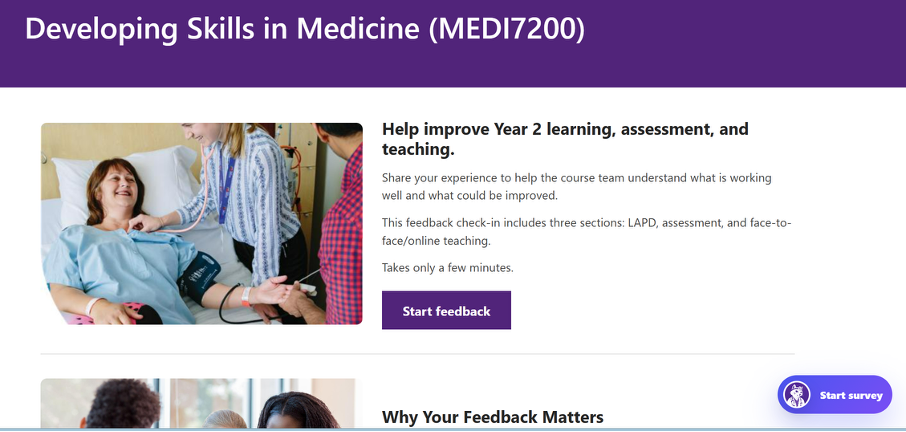
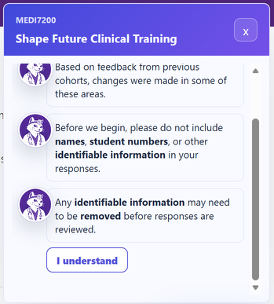
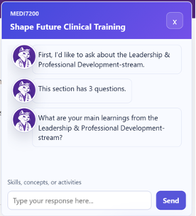
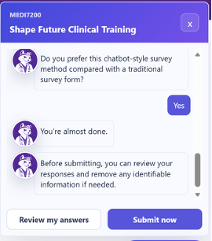

# MEDI7200 Feedback Chatbot

> A course-tailored, chatbot-style survey for collecting focused and actionable student feedback.

This repository contains the interactive demonstration of a 2026 pilot for **MEDI7200 — Developing Skills in Medicine**. Instead of presenting every question in a conventional form, the interface guides students through a short conversation about Leadership and Professional Development (LAPD), assessment, and face-to-face/online teaching.

The chatbot is **rule-based, not generative AI**. Its purpose is to test a conversational survey format and course-specific prompts as a supplementary feedback mechanism—not to replace SECaT or claim that chatbots outperform traditional surveys.

## Demo



<table>
  <tr>
    <td width="33%"></td>
    <td width="33%"></td>
    <td width="33%"></td>
  </tr>
  <tr>
    <td align="center"><strong>Privacy first</strong><br />Students are reminded not to enter identifiable information.</td>
    <td align="center"><strong>Guided reflection</strong><br />Questions and prompts are presented one step at a time.</td>
    <td align="center"><strong>Review before submission</strong><br />Students can revisit answers and remove identifying details.</td>
  </tr>
</table>

## What the prototype explores

- **Course-tailored questions** developed around MEDI7200 teaching priorities
- **Three feedback areas:** LAPD, assessment and progression, and teaching mode
- **Mixed response types:** open text, single choice, and multiple choice
- **Student-facing prompts** that suggest relevant aspects to reflect on
- **Conversational pacing** with section transitions, typing indicators, and short encouragement messages
- **Review and edit** before final submission
- **Privacy-by-design onboarding** before any questions are shown

## Survey journey

```text
Course landing page
        ↓
Context and privacy reminder
        ↓
LAPD (3 questions)
        ↓
Assessment and progression (4 questions)
        ↓
Face-to-face and online teaching (4 questions)
        ↓
Survey-method preference (1 question)
        ↓
Review, edit, and submit
```

Question wording, response types, prompts, and section transitions are defined in [`src/commentChatConfig.ts`](src/commentChatConfig.ts).

## Pilot context and results

The opt-in pilot ran from **27 May to 8 June 2026** and invited approximately **400 MEDI7200 students**. The question set and conversational messages were co-designed with medical school staff, lecturers, and the MEDI7200 course team.

| Indicator | Pilot result |
| --- | ---: |
| Recorded survey starts | 48 |
| Completed submissions | 41 (85.4% of recorded starts) |
| Partial submissions | 7 (14.6%) |
| Chatbot preferred over a traditional form | 21 of 41 (51.2%) |
| Open-text feedback | Approximately 17,860 words |

Responses included detailed, course-specific feedback about assessment clarity, workload and timing, learning activities, progression guidance, and the appropriate use of online and face-to-face teaching.

These results demonstrate **feasibility and the collection of useful feedback**, but they do not establish that students prefer the chatbot format or that it performs better than a conventional survey. The pilot had no conventional-survey comparison group, and participation was modest relative to the invited cohort.

## Privacy and data handling

This public repository is configured as a **non-production demonstration**:

- responses remain only in React state while the page is open;
- no response is sent to Google Sheets, an API, or another external service;
- no response is written to local storage or local files; and
- refreshing or closing the page clears the current response.

The original pilot used a Google Apps Script endpoint and Google Sheets to record partial and completed responses. That integration is intentionally not included in this demo. A production deployment should add appropriate ethics, consent, security, retention, access-control, and privacy review.

## Run locally

Requirements: [Node.js](https://nodejs.org/) 20 or later and npm.

```bash
git clone https://github.com/yunyahuang49343827-dot/MEDI7200-Feedback-Chatbot.git
cd MEDI7200-Feedback-Chatbot
npm install
npm run dev
```

Vite will open the local development site. To verify a production build:

```bash
npm run build
npm run preview
```

## Customise the survey

1. Edit the questions and response options in [`src/commentChatConfig.ts`](src/commentChatConfig.ts).
2. Update the course landing page and chatbot title in [`src/App.tsx`](src/App.tsx).
3. Adjust branding and responsive layout in [`src/styles.css`](src/styles.css).
4. To connect an approved backend, replace the demonstration `onSubmitComments` and `onSavePartial` handlers passed to `useCommentChatFlow` in [`src/App.tsx`](src/App.tsx).

Each question has an input type (`text`, `choice`, or `multiChoice`), a response key, and optional section-transition text. New fields should also be added to `CommentChatResponses` and `createInitialCommentChatResponses()`.

## Technology

- React 19
- TypeScript
- Vite
- Plain CSS

The demonstration has no runtime backend or database dependency.

## Project structure

```text
public/images/                     Landing-page images and chatbot avatar
docs/images/                       README demonstration screenshots
src/App.tsx                        Course page and chatbot wiring
src/commentChatConfig.ts           Questions, response types, and survey copy
src/hooks/useCommentChatFlow.ts    Conversation state and transitions
src/hooks/useTypewriter.ts         Bot-message animation
src/components/OnboardingFlow.tsx  Context and privacy reminder
src/components/CommentChatFlow.tsx Questions, review, editing, and submission
src/components/MessageText.tsx     Chat-message text rendering
src/styles.css                     Layout, branding, and responsive styles
```

## Scope

This codebase is a research and teaching prototype. It is not a clinical tool, does not provide medical advice, and should not be used to collect real student data without the necessary institutional approvals and a reviewed data-handling implementation.
